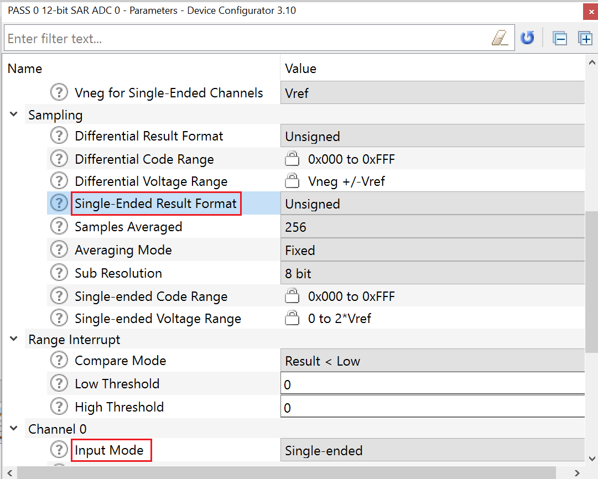

# EZ-PD&trade; PMG1 MCU: 12-bit SAR ADC basic

This code example demonstrates the method of using the 12-bit SAR ADC on EZ-PD&trade; PMG1-S3 and EZ-PD&trade; PMG1-B1 MCUs to read the input voltage applied in both differential and single-ended modes and display the measured voltage and corresponding output codes in signed or unsigned format. It also explains the configuration of PASS 0 12-bit SAR ADC 0 using the Device Configurator on ModusToolbox&trade;.


[View this README on GitHub.](https://github.com/Infineon/mtb-example-pmg1-12-bit-saradc-basic)

[Provide feedback on this code example.](https://cypress.co1.qualtrics.com/jfe/form/SV_1NTns53sK2yiljn?Q_EED=eyJVbmlxdWUgRG9jIElkIjoiQ0UyMzQ2NDkiLCJTcGVjIE51bWJlciI6IjAwMi0zNDY0OSIsIkRvYyBUaXRsZSI6IkVaLVBEJnRyYWRlOyBQTUcxIE1DVTogMTItYml0IFNBUiBBREMgYmFzaWMiLCJyaWQiOiJlYXNvdmFyZ2hlc2UiLCJEb2MgdmVyc2lvbiI6IjIuMi4wIiwiRG9jIExhbmd1YWdlIjoiRW5nbGlzaCIsIkRvYyBEaXZpc2lvbiI6Ik1DRCIsIkRvYyBCVSI6IldJUkVEIiwiRG9jIEZhbWlseSI6IlRZUEUtQyJ9)


## Requirements

- [ModusToolbox&trade;](https://www.infineon.com/modustoolbox) v3.0 or later (tested with v3.0)
- Board support package (BSP) minimum required version: 3.0.0
- Programming language: C
- Associated parts: [EZ-PD&trade; PMG1_S3, PMG1-B1, EVAL_PMG1-S3_DUALDRP MCU](https://www.infineon.com/PMG1)


## Supported toolchains (make variable 'TOOLCHAIN')

- GNU Arm&reg; Embedded Compiler v10.3.1 (`GCC_ARM`) – Default value of `TOOLCHAIN`
- Arm&reg; Compiler v6.13 (`ARM`)
- IAR C/C++ Compiler v8.42.2 (`IAR`)


## Supported kits (make variable 'TARGET')

- [EZ-PD&trade; PMG1-S3 Prototyping Kit](https://www.infineon.com/CY7113) (`PMG1-CY7113`) – Default value of `TARGET`
- [EZ-PD&trade; PMG1-B1 Prototyping Kit](https://www.infineon.com/EVAL_PMG1_B1_DRP) (`EVAL_PMG1_B1_DRP`)
- [EZ-PD&trade; EVAL_PMG1-S3_DUALDRP Prototyping Kit](https://www.infineon.com/EVAL_PMG1_S3_DUALDRP) (`EVAL_PMG1_S3_DUALDRP`)


## Hardware setup

1. Connect the board to your PC using a USB cable through the KitProg3 USB connector (J1). This cable is used for programming the PMG1 device and can be used during debugging. In addition, it transfers the UART data from the serial port to the PC to display it on a serial monitor.

2. Connect the USB PD port (J10) to a USB-C power adapter/USB port on PC using a Type-C/Type-A to Type-C cable to power the PMG1 device for normal operation.

3. For PMG1-S3 kits revision 3 or lower, connect the UART Tx (J6.10) and UART Rx (J6.9) lines from the PMG1 kit to J3.8 and J3.10 on KitProg3 respectively to establish a UART connection between KitProg3 and the PMG1 device. Kits with a higher revision have UART lines internally connected and therefore, external wiring is not required. For EVAL_PMG1_B1_DRP kit, change SW5 to 1-2 position and SW4 to 1-2 position to establish a UART connection between KitProg3 and the PMG1 device.


4. By default, the ADC is configured to read differential input voltage applied across Vplus (P3.0 (J6.12)) and Vminus (P3.3 (J6.11)) pins of PASS0 SARADC0 for the PMG1-S3 kit, across Vplus (P3.0 (J13.3)) and Vminus P3.3 (J13.1) pins of PASS0 SARADC0 for the EVAL_PMG1-S3_DUALDRP kit, and Vplus (P3.0 (J7.7)) and Vminus (P3.1 (J7.6)) pins of PASS0 SARADC0 for the EVAL_PMG1_B1_DRP kit.

5. Do the following hardware connection for differential mode (signed and unsigned). See **Figure 1** and **Table 1** for the PMG1-S3 kit connections and **Table 1** for the EVAL_PMG1_B1_DRP kit connections.

	**Table 1. Hardware connection for Differential mode (Signed and Unsigned) for PMG1 kit**
	
	 PMG1 prototyping kit  | Differential source positive signal (Vplus) | Differential source negative signal (Vminus) 
	 :-------       | :------------ | :----------     
	 PMG1-CY7113 | P3.0 (J6.12) | P3.3 (J6.11) 
	 EVAL_PMG1_B1_DRP | P3.0 (J7.7) | P3.1 (J7.6) 
	 EVAL_PMG1_S3_DUALDRP | P3.0 (J13.3) | P3.3 (J13.1)
	
	<br>

6. Make the following hardware connection for single-ended mode (signed and unsigned). See **Figure 2** for single-ended input mode connection. **Table 2** shows the kit connections for PMG1-S3 and EVAL_PMG1_B1_DRP kits.

	**Table 2. Hardware connection for Single-ended mode (Signed and Unsigned) for PMG1 kit**
	
	 PMG1 prototyping kit  | Input Signal (Vplus) |
	 :-------    | :------------ 
	 PMG1-CY7113 | P3.0 (J6.12) 
	 EVAL_PMG1_B1_DRP | P3.0 (J7.7) 
	 EVAL_PMG1_S3_DUALDRP | P3.0 (J13.3)
	
	<br>


See the kit user guide for details on configuring the board.

**Figure 1. Differential mode connection diagram**


**Figure 2. Single ended mode connection diagram**


## Software setup

See the [ModusToolbox&trade; tools package installation guide](https://www.infineon.com/ModusToolboxInstallguide) for information about installing and configuring the tools package.


Install a terminal emulator if you don't have one. Instructions in this document use [Tera Term](https://teratermproject.github.io/index-en.html).

This example requires no additional software or tools.


## Using the code example

### Create the project

The ModusToolbox&trade; tools package provides the Project Creator as both a GUI tool and a command line tool.

<details><summary><b>Use Project Creator GUI</b></summary>

1. Open the Project Creator GUI tool.

   There are several ways to do this, including launching it from the dashboard or from inside the Eclipse IDE. For more details, see the [Project Creator user guide](https://www.infineon.com/ModusToolboxProjectCreator) (locally available at *{ModusToolbox&trade; install directory}/tools_{version}/project-creator/docs/project-creator.pdf*).

2. On the **Choose Board Support Package (BSP)** page, select a kit supported by this code example. See [Supported kits](#supported-kits-make-variable-target).

   > **Note:** To use this code example for a kit not listed here, you may need to update the source files. If the kit does not have the required resources, the application may not work.

3. On the **Select Application** page:

   a. Select the **Applications(s) Root Path** and the **Target IDE**.

   > **Note:** Depending on how you open the Project Creator tool, these fields may be pre-selected for you.

   b.	Select this code example from the list by enabling its check box.

   > **Note:** You can narrow the list of displayed examples by typing in the filter box.

   c. (Optional) Change the suggested **New Application Name** and **New BSP Name**.

   d. Click **Create** to complete the application creation process.

</details>

<details><summary><b>Use Project Creator CLI</b></summary>

The 'project-creator-cli' tool can be used to create applications from a CLI terminal or from within batch files or shell scripts. This tool is available in the *{ModusToolbox&trade; install directory}/tools_{version}/project-creator/* directory.

Use a CLI terminal to invoke the 'project-creator-cli' tool. On Windows, use the command-line 'modus-shell' program provided in the ModusToolbox&trade; installation instead of a standard Windows command-line application. This shell provides access to all ModusToolbox&trade; tools. You can access it by typing "modus-shell" in the search box in the Windows menu. In Linux and macOS, you can use any terminal application.

The following example clones the "[mtb-example-pmg1-12-bit-saradc-basic](https://github.com/Infineon/mtb-example-pmg1-12-bit-saradc-basic)" application with the desired name "My12bitSaradcBasic" configured for the *PMG1-CY7113* BSP into the specified working directory, *C:/mtb_projects*:

   ```
   project-creator-cli --board-id PMG1-CY7113 --app-id mtb-example-pmg1-12-bit-saradc-basic --user-app-name My12bitSaradcBasic --target-dir "C:/mtb_projects"
   ```

The 'project-creator-cli' tool has the following arguments:

Argument | Description | Required/optional
---------|-------------|-----------
`--board-id` | Defined in the <id> field of the [BSP](https://github.com/Infineon?q=bsp-manifest&type=&language=&sort=) manifest | Required
`--app-id`   | Defined in the <id> field of the [CE](https://github.com/Infineon?q=ce-manifest&type=&language=&sort=) manifest | Required
`--target-dir`| Specify the directory in which the application is to be created if you prefer not to use the default current working directory | Optional
`--user-app-name`| Specify the name of the application if you prefer to have a name other than the example's default name | Optional

> **Note:** The project-creator-cli tool uses the `git clone` and `make getlibs` commands to fetch the repository and import the required libraries. For details, see the "Project creator tools" section of the [ModusToolbox&trade; tools package user guide](https://www.infineon.com/ModusToolboxUserGuide) (locally available at {ModusToolbox&trade; install directory}/docs_{version}/mtb_user_guide.pdf).

</details>


### Open the project

After the project has been created, you can open it in your preferred development environment.


<details><summary><b>Eclipse IDE</b></summary>

If you opened the Project Creator tool from the included Eclipse IDE, the project will open in Eclipse automatically.

For more details, see the [Eclipse IDE for ModusToolbox&trade; user guide](https://www.infineon.com/MTBEclipseIDEUserGuide) (locally available at *{ModusToolbox&trade; install directory}/docs_{version}/mt_ide_user_guide.pdf*).

</details>


<details><summary><b>Visual Studio (VS) Code</b></summary>

Launch VS Code manually, and then open the generated *{project-name}.code-workspace* file located in the project directory.

For more details, see the [Visual Studio Code for ModusToolbox&trade; user guide](https://www.infineon.com/MTBVSCodeUserGuide) (locally available at *{ModusToolbox&trade; install directory}/docs_{version}/mt_vscode_user_guide.pdf*).

</details>


<details><summary><b>Keil µVision</b></summary>

Double-click the generated *{project-name}.cprj* file to launch the Keil µVision IDE.

For more details, see the [Keil µVision for ModusToolbox&trade; user guide](https://www.infineon.com/MTBuVisionUserGuide) (locally available at *{ModusToolbox&trade; install directory}/docs_{version}/mt_uvision_user_guide.pdf*).

</details>


<details><summary><b>IAR Embedded Workbench</b></summary>

Open IAR Embedded Workbench manually, and create a new project. Then select the generated *{project-name}.ipcf* file located in the project directory.

For more details, see the [IAR Embedded Workbench for ModusToolbox&trade; user guide](https://www.infineon.com/MTBIARUserGuide) (locally available at *{ModusToolbox&trade; install directory}/docs_{version}/mt_iar_user_guide.pdf*).

</details>


<details><summary><b>Command line</b></summary>

If you prefer to use the CLI, open the appropriate terminal, and navigate to the project directory. On Windows, use the command-line 'modus-shell' program; on Linux and macOS, you can use any terminal application. From there, you can run various `make` commands.

For more details, see the [ModusToolbox&trade; tools package user guide](https://www.infineon.com/ModusToolboxUserGuide) (locally available at *{ModusToolbox&trade; install directory}/docs_{version}/mtb_user_guide.pdf*).

</details>


## Operation

1. Complete the steps listed in the [Hardware setup](#hardware-setup) section.

2. For PMG1-CY7113 and EVAL_PMG1_S3_DUALDRP, ensure that the jumper shunt on power selection jumper (J5) is placed at position 2-3 to enable programming mode. Skip this step for EVAL_PMG1_B1_DRP.

3. Connect the board to your PC using the USB cable through the KitProg3 USB connector (J1). This cable is used for programming the PMG1 device.

4. Program the board using one of the following:

   <details><summary><b>Using Eclipse IDE</b></summary>

      1. Select the application project in the Project Explorer.

      2. In the **Quick Panel**, scroll down, and click **\<Application Name> Program (KitProg3_MiniProg4)**.
   </details>


   <details><summary><b>In other IDEs</b></summary>

   Follow the instructions in your preferred IDE.
   </details>


   <details><summary><b>Using CLI</b></summary>

     From the terminal, execute the `make program` command to build and program the application using the default toolchain to the default target. The default toolchain is specified in the application's Makefile but you can override this value manually:
      ```
      make program TOOLCHAIN=<toolchain>
      ```

      Example:
      ```
      make program TOOLCHAIN=GCC_ARM
      ```
     > **Note:** This application supports only PMG1-CY7113 BSP and EVAL_PMG1_B1_DRP BSP.
   </details>


5. After programming the kit, disconnect the USB cable. Move to the next step for EVAL_PMG1_B1_DRP and EVAL_PMG1-S3_DUALDRP kits. Change the position on the power selection jumper (J5) to 1-2, to power the kit through the USB PD port (J10) in operational mode for PMG1-CY7113 prototyping kit.


6. Reconnect the USB cable to KitProg3 Type-C port (J1).

7. Open a terminal program and select the KitProg3 COM port. Set the serial port parameters to 8N1 and 115200 baud.

8. For PMG1-CY7113, power the kit through the USB PD port (J10), using the second USB cable. For EVAL_PMG1_S3_DUALDRP, power the kit through USB PD port(J10 or J14).Skip this step for the EVAL_PMG1_B1_DRP kit as it is automatically powered when the kit is connected through the KitProg3 USB Type-C port (J1).

   As soon as the kit is powered through the USB PD port, the application starts printing **Displaying 12-bit SAR ADC output: DIFFERENTIAL mode - Signed**. Consequently, the digital output codes and the corresponding value of the measured analog input voltages are automatically displayed at an interval of 500 milliseconds each.

9. Measure the voltage applied to the Vplus/Vminus input of the ADC using a multimeter and compare with the corresponding voltages and digital codes displayed on the serial terminal, using the standard ADC conversion formula:

   Code = (Vin/Vref)*(2^n - 1), where n is the resolution in number of bits used for representing the digital code.

> **Note** The ADC is configured in differential input mode by default. To change the input into single-ended or differential mode and to choose the resultant output code format as signed/unsigned, see the configuration in the [Design and implementation](#design-and-implementation) section.

**Figure 3. UART terminal display of signed and unsigned code format**


**Table 3. Input signal range for ADC modes**

 Mode  |  Differential input signal |Min range |  Max range 
 :------- | :------------    | :------------ | :------------
 Differential - Signed |  -1.2 V to 1.2 V | -2048 | 2047 
 Differential - Unsigned | -1.2 V to 1.2 V | 0 | 4095 
 Single - Signed | 0 V to 2.4 V |  -2048 | 2047 
 Single - Unsigned | 0 V to 2.4 V | 0 | 4095 

<br>

> **Note:** All input signals should be within the voltage range (0 to VDDIO) with respect to system ground.


## Debugging

<details><summary><b>In Eclipse IDE</b></summary>

Use the **\<Application Name> Debug (KitProg3_MiniProg4)** configuration in the **Quick Panel**. Ensure that the board is connected to your PC using the USB cable through the KitProg3 USB Type-C port (J1). For PMG1-CY7113 and EVAL_PMG1-S3_DUALDRP Prototyping Kits, ensure the jumper shunt on power selection jumper (J5) is placed at position 1-2.

</details>


<details><summary><b>In other IDEs</b></summary>

Follow the instructions in your preferred IDE.
</details>


## Design and implementation

This code example uses the 12-bit SAR ADC provided in the programmable analog block, available on PMG1-S3 and EVAL_PMG1_B1_DRP devices. This ADC can be configured using the Device Configurator tool in ModusToolbox&trade;.

PASS0 SARADC0 has three inputs: Vplus, Vminus, and ext_vref. The inputs can be routed to the required external pins using a set of firmware-controlled switches used for analog routing.

PASS 0 12-bit SAR ADC 0 has two input modes: differential mode and single-ended mode. In differential input mode, a differential signal can be applied across the Vplus and Vminus input pins of the ADC. This mode is suitable for reading signals that vary in both positive and negative sides, such as an alternating current (AC) signal. Single-ended input modes are preferred for reading analog direct current (DC) signals. In addition to this, the output code can be displayed in both signed and unsigned formats.

Detailed configuration of PASS 0 12-bit SAR ADC 0 for parameters such as reference voltage, resolution, number of channels, scan rate, channel acquisition time, clock frequency, input mode, result format, interrupts and more are included in the Device Configurator tool as shown below:


### PASS 0 12-bit SAR ADC 0 configuration

1. Select the application project in the Project Explorer.

2. In the **Quick Panel**, scroll down to **BSP Configurators** section, and click **Device Configurator**.

   **Figure 4. PASS 0 12-bit SAR ADC 0 configuration using Device Configurator**

   

3. On the Device Configurator, select **PASS 0 12-bit SAR ADC 0** under **Programmable Analog (PASS) 0** in **Peripherals** tab. This opens the ADC configuration fields, and make the following changes:

   1. In the **Channel 0** section, select input modes as **Differential** or **Single-ended**.

   2. Under the **Sampling** section, select the output result formats as **Signed** or **Unsigned**.

   3. Change other parameters to modify the performance of ADC as per the application requirements.

     > **Note:** If you make any changes on the Device Configurator, save the changes and then reprogram the kit to activate the new configuration.

      **Figure 5. PASS 0 12-bit SAR ADC 0 configuration using Device Configurator**

      

   Some of the important parameters responsible for the performance of PASS 0 12-bit SAR ADC 0 are listed below:

   1. To get the maximum resolution, choose **Internal BangGap Reference** as to 1.2 V, which is the lowest value of reference voltage (Vref).

   2. Because of the low frequency operation of the ADC (between 1.7 MHz and 1.8 MHz), do not use the **bypass capacitor**.

   3. Set the ADC **clock frequency** to 1.778 MHz using a suitable divider value to enable the operation without a Vref bypass capacitor.

       > **Note** Any clock frequency greater than 1.8 MHz requires an external Vref bypass capacitor to be connected to the ext_Vref pin for faithful code conversion.

   4. Select **Full Resolution 12-bit** to ensure maximum performance of the ADC.

   5. Set **Samples Averaged** to **256** to minimize the effect of noise and other errors. This results in averaging out 256 samples from a particular channel, in a single scan, to generate the final ADC output code value.

   6. For a fixed clock frequency, **Achieved Free-Run Scan Rate (sps)** depends on **Target Scan Rate (sps)**, **Minimum Acquisition Time (ns)** and **Sampled Averaged**. See the Scan Rate section in the [SAR ADC PDL API Reference](https://infineon.github.io/mtb-pdl-cat2/pdl_api_reference_manual/html/group__group__sar.html). Note that the achieved scan duration is 2.304 milliseconds for an acquisition time of 562 nanoseconds.

  > **Note:** By default, the ADC is configured for **differential input**, with **signed output code format**. To modify the configuration between single-ended/differential input mode and signed/unsigned output code format, see [Differential mode](#differential-mode) and [Single-ended mode](#single-ended-mode).

   The pins P3.0 and P3.3 are assigned to Vplus and Vminus inputs for PASS 0 12-bit SAR ADC 0 fo the PMG1-S3 kit respectively and the pins P3.0 and P3.1 are assigned to Vplus and Vminus inputs for PASS 0 12-bit SAR ADC 0 for the EVAL_PMG1_B1_DRP kit respectively. The internal signal routing can be viewed using the **Analog Routing** tab in the Device Configurator as shown in the following figure.

   **Figure 6. Analog routing in Device Configurator for PMG1-S3**

   


> **Note:** For PMG1-S3 kit , port-2 pins are reserved for connecting directly to PASS 0 12-bit SAR ADC 0 on PMG1-S3 devices. But in this example, port-2 pins cannot be used as they are wired onto other peripherals, in CY7113 and EVAL_PMG1_S3_DUALDRP prototyping kits. Therefore, in this example, connection to Vplus and Vminus are routed to other pins through AMUXBUSA/B for CY7113 and EVAL_PMG1_S3_DUALDRP as described in the **Info** tab in the **Notice List**.


   
   **Figure 7. Analog routing in Device Configurator for EVAL_PMG1_B1_DRP**

   

> **Note:** For PMG1-B1 kit , port 1 pins are reserved for connecting direclty to PASS 0 12-bit SAR ADC 0 on PMG1-B1 devices. But in this example, port 1 pins cannot be used as they are wired onto other peripherals, in EVAL_PMG1_B1_DRP prototyping kits. Therefore, in this example, connection to Vplus and Vminus are routed to other pins through AMUXBUSA/B, as described in the **Info** tab in the **Notice List**.


#### Differential mode (default)

In differential input mode, a differential signal can be applied across the Vplus and Vminus pins of the PASS 0 12-bit SAR ADC 0. In this example, 1.2 V (internal bandgap reference) is set as the reference voltage (Vref) for the ADC.

In signed output code format (default), the differential code range in decimal value varies from -2048 (0x800) to 2047 (0x7FF), giving a total of 4095 digital codes:

**Figure 7. Differential input- signed output code**


The code -2048 corresponds to the Vminus input equal to Vref (1.2 V) and Vplus input at ground (0 V). Similarly, code 2047 corresponds to the Vplus input equal to Vref (1.2 V) and Vminus input at ground (0 V). This can be achieved by interchanging the potentiometer input connection and the ground connection between the Vplus and Vminus pins of the ADC. For PMG1-S3 kit, Vplus pin is J6.11 and Vminus pin is J6.12, for EVAL_PMG1_B1_DRP kit, Vplus pin is J7.7 and Vminus pin is J7.6, and for EVAL_PMG1-S3_DUALDRP kit, Vplus pin is J13.3 and Vminus pin is J13.1.

Differential result format can be changed to **Unsigned** under the **Sampling** section. In unsigned output code format, the differential code range in decimal value varies from 0 (0x000) to 4095 (0xFFF), giving a total of 4095 codes as follows:

**Figure 8. Differential input - unsigned output code**


The code 0 corresponds to the Vminus input equal to Vref (1.2 V) and Vplus input at ground (0 V). Similarly, code 4095 corresponds to the Vplus input equal to Vref (1.2 V) and Vminus input at ground (0 V).


#### Single-ended mode

To change the ADC input mode from Differential to Single-ended, navigate to the **Channel 0** tab in **PASS 0 12-bit SAR ADC 0** and change the **Input Mode** to **Single-ended**. Note that for single-ended mode, the connection to the Vminus input pin of the ADC must be removed as notified in the **Task** tab under the **Notice List**.

In single-ended input mode, an analog signal is applied to the Vplus input of the PASS 0 12-bit SAR ADC 0 with the Vneg pin connected internally to either of the three options: VSSA, Vref, or Routed.

In this example, Vneg is connected to **Vref** (1.2 V) under **Connections** in **PASS 0 12-bit SAR ADC 0**. Note that other values for reference signals such as VDDA or VDDA/2 or reference voltage from an external pin may also be used according to application requirements.

In signed output code format (default), the single-ended code range in decimal value varies from -2048 (0x800) to 2047 (0x7FF), giving a total of 4095 digital codes as shown in the following figure.

**Figure 9. Single-ended input - signed output code**


The code -2048 corresponds to the Vplus input at 0 V. Similarly, the code 2047 corresponds to the Vplus input equal to 2*Vref (2.4 V). Note that the potentiometer is powered from 3.3 V. Therefore, a full rotation of the potentiometer provides 3.3 V at the Vplus input of the ADC.

Single-ended result format can be changed to **Unsigned** under **Sampling**. In the unsigned output code format, the single-ended code range in decimal value varies from 0 (0x000) to 4095 (0xFFF), giving a total of 4095 digital codes as follows:

**Figure 10. Single-ended input - unsigned output code**



The code 0 corresponds to the Vplus input at 0 V. Similarly, the code 4095 corresponds to the Vplus input equal to 2*Vref (2.4 V).

Note that the maximum voltage swing across Vplus and Vneg pin that the ADC can read is equal to Vref.

It implies | Vplus - Vneg | <= Vref


**Figure 11. Firmware flowchart**


> **Note:** This ADC configuration results in a sample conversion delay of 2.304 milliseconds (scan duration) after triggering. This time interval may be effectively utilized to run codes to perform some user-defined tasks. However, a delay of 500 milliseconds has been allotted between each ADC sample display to slow down the UART terminal display rate for a better visibility.


### Compile-time configurations

The EZ-PD&trade; PMG1 MCU 12-bit SAR ADC basic application functionality can be customized through the compile-time parameter that can be turned ON or OFF through the *main.c* file.

 Macro name       | Description          | Allowed values
 :--------------- | :----------------    | :-----------
 `DEBUG_PRINT`    | Debug print macro to enable UART print | 1u to enable <br> 0u to disable

<br>


### Resources and settings

**Table 4. Application resources**

 Resource  |  Alias/object     |    Purpose
 :-------- | :-------------    | :------------
 Programmable Analog (PASS) 0    | PASS 0 12-bit SAR ADC 0    | 12-bit SAR ADC is used to convert analog input voltage to digital codes
 SCB (PDL)	| CYBSP_UART    | UART SCB block is used for serial communication, to send ADC code values through serial port

<br>


## Related resources

Resources | Links
-----------|------------------
Application notes | [AN232553](https://www.infineon.com/AN232553) – Getting started with EZ-PD&trade; PMG1 MCU on ModusToolbox&trade; <br> [AN232565](https://www.infineon.com/an232565) – EZ-PD&trade; PMG1 hardware design guidelines and checklist <br> [AN238945](https://www.infineon.com/AN238945) – Getting started with EZ-PD&trade; PMG1-B1 MCU using ModusToolbox&trade;
Code examples  | [Using ModusToolbox&trade;](https://github.com/Infineon/Code-Examples-for-ModusToolbox-Software) on GitHub
Device documentation | [EZ-PD&trade; PMG1 MCU datasheets](https://www.infineon.com/PMG1DS)
Development kits | Select your kits from the [Evaluation Board Finder](https://www.infineon.com/cms/en/design-support/finder-selection-tools/product-finder/evaluation-board) page.
Libraries on GitHub | [mtb-pdl-cat2](https://github.com/Infineon/mtb-pdl-cat2) – Peripheral Driver Library (PDL)
Tools  | [ModusToolbox&trade;](https://www.infineon.com/modustoolbox) – ModusToolbox&trade; software is a collection of easy-to-use libraries and tools enabling rapid development with Infineon MCUs for applications ranging from wireless and cloud-connected systems, edge AI/ML, embedded sense and control, to wired USB connectivity using PSoC&trade; Industrial/IoT MCUs, AIROC&trade; Wi-Fi and Bluetooth&reg; connectivity devices, XMC&trade; Industrial MCUs, and EZ-USB&trade;/EZ-PD&trade; wired connectivity controllers. ModusToolbox&trade; incorporates a comprehensive set of BSPs, HAL, libraries, configuration tools, and provides support for industry-standard IDEs to fast-track your embedded application development.

<br>


## Other resources

Infineon provides a wealth of data at [www.infineon.com](https://www.infineon.com) to help you select the right device, and quickly and effectively integrate it into your design.


## Document history

Document title: *CE234649* – *EZ-PD&trade; PMG1 MCU: 12-bit SAR ADC basic*

 Version | Description of change 
 ------- | --------------------- 
 1.0.0   | New code example      
 2.0.0   | Major update to support ModusToolbox&trade; v3.0. This version is not backward compatible with previous versions of ModusToolbox&trade; 
 2.1.0   | Update to support EVAL_PMG1_B1_DRP kit 
 2.2.0   | Update to support EVAL_PMG1_S3_DUALDRP
------

<br>


All referenced product or service names and trademarks are the property of their respective owners.

The Bluetooth&reg; word mark and logos are registered trademarks owned by Bluetooth SIG, Inc., and any use of such marks by Infineon is under license.


---------------------------------------------------------

© Cypress Semiconductor Corporation, 2022-2024. This document is the property of Cypress Semiconductor Corporation, an Infineon Technologies company, and its affiliates ("Cypress").  This document, including any software or firmware included or referenced in this document ("Software"), is owned by Cypress under the intellectual property laws and treaties of the United States and other countries worldwide.  Cypress reserves all rights under such laws and treaties and does not, except as specifically stated in this paragraph, grant any license under its patents, copyrights, trademarks, or other intellectual property rights.  If the Software is not accompanied by a license agreement and you do not otherwise have a written agreement with Cypress governing the use of the Software, then Cypress hereby grants you a personal, non-exclusive, nontransferable license (without the right to sublicense) (1) under its copyright rights in the Software (a) for Software provided in source code form, to modify and reproduce the Software solely for use with Cypress hardware products, only internally within your organization, and (b) to distribute the Software in binary code form externally to end users (either directly or indirectly through resellers and distributors), solely for use on Cypress hardware product units, and (2) under those claims of Cypress's patents that are infringed by the Software (as provided by Cypress, unmodified) to make, use, distribute, and import the Software solely for use with Cypress hardware products.  Any other use, reproduction, modification, translation, or compilation of the Software is prohibited.
<br>
TO THE EXTENT PERMITTED BY APPLICABLE LAW, CYPRESS MAKES NO WARRANTY OF ANY KIND, EXPRESS OR IMPLIED, WITH REGARD TO THIS DOCUMENT OR ANY SOFTWARE OR ACCOMPANYING HARDWARE, INCLUDING, BUT NOT LIMITED TO, THE IMPLIED WARRANTIES OF MERCHANTABILITY AND FITNESS FOR A PARTICULAR PURPOSE.  No computing device can be absolutely secure.  Therefore, despite security measures implemented in Cypress hardware or software products, Cypress shall have no liability arising out of any security breach, such as unauthorized access to or use of a Cypress product. CYPRESS DOES NOT REPRESENT, WARRANT, OR GUARANTEE THAT CYPRESS PRODUCTS, OR SYSTEMS CREATED USING CYPRESS PRODUCTS, WILL BE FREE FROM CORRUPTION, ATTACK, VIRUSES, INTERFERENCE, HACKING, DATA LOSS OR THEFT, OR OTHER SECURITY INTRUSION (collectively, "Security Breach").  Cypress disclaims any liability relating to any Security Breach, and you shall and hereby do release Cypress from any claim, damage, or other liability arising from any Security Breach.  In addition, the products described in these materials may contain design defects or errors known as errata which may cause the product to deviate from published specifications. To the extent permitted by applicable law, Cypress reserves the right to make changes to this document without further notice. Cypress does not assume any liability arising out of the application or use of any product or circuit described in this document. Any information provided in this document, including any sample design information or programming code, is provided only for reference purposes.  It is the responsibility of the user of this document to properly design, program, and test the functionality and safety of any application made of this information and any resulting product.  "High-Risk Device" means any device or system whose failure could cause personal injury, death, or property damage.  Examples of High-Risk Devices are weapons, nuclear installations, surgical implants, and other medical devices.  "Critical Component" means any component of a High-Risk Device whose failure to perform can be reasonably expected to cause, directly or indirectly, the failure of the High-Risk Device, or to affect its safety or effectiveness.  Cypress is not liable, in whole or in part, and you shall and hereby do release Cypress from any claim, damage, or other liability arising from any use of a Cypress product as a Critical Component in a High-Risk Device. You shall indemnify and hold Cypress, including its affiliates, and its directors, officers, employees, agents, distributors, and assigns harmless from and against all claims, costs, damages, and expenses, arising out of any claim, including claims for product liability, personal injury or death, or property damage arising from any use of a Cypress product as a Critical Component in a High-Risk Device. Cypress products are not intended or authorized for use as a Critical Component in any High-Risk Device except to the limited extent that (i) Cypress's published data sheet for the product explicitly states Cypress has qualified the product for use in a specific High-Risk Device, or (ii) Cypress has given you advance written authorization to use the product as a Critical Component in the specific High-Risk Device and you have signed a separate indemnification agreement.
<br>
Cypress, the Cypress logo, and combinations thereof, ModusToolbox, PSoC, CAPSENSE, EZ-USB, F-RAM, and TRAVEO are trademarks or registered trademarks of Cypress or a subsidiary of Cypress in the United States or in other countries. For a more complete list of Cypress trademarks, visit www.infineon.com. Other names and brands may be claimed as property of their respective owners.
